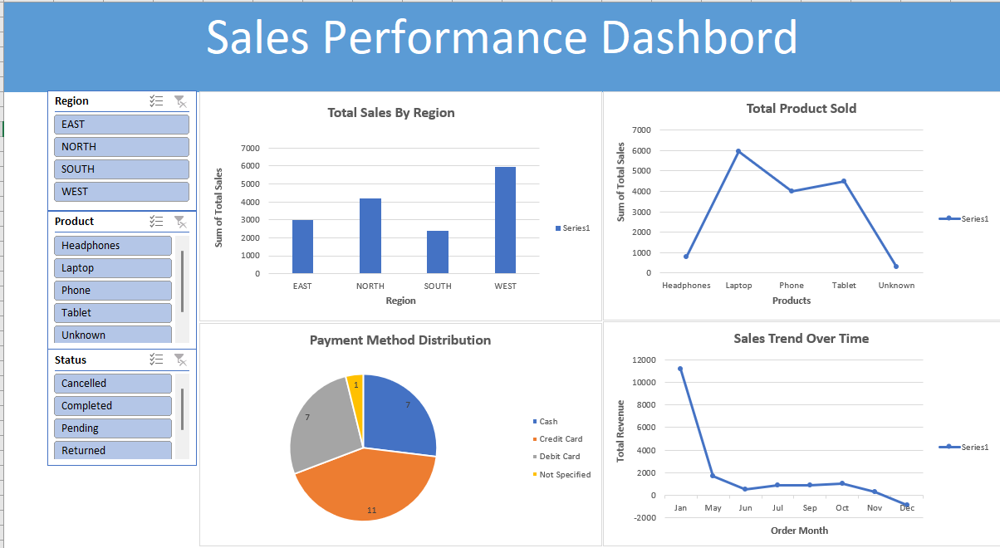

# Sales-data-cleaning-project
Cleaned and analyzed messy sales data using Excel and MySQL, with data transformation, validation, and an interactive dashboard for business insights.
https://github.com/VaminetAgunwa/Sales-data-cleaning-project

# Record Sales Data Cleaning Project

## Overview
This project demonstrates cleaning and analyzing messy sales data using Excel and MySQL.

## Tools Used
- Excel
- MySQL

## Tasks Performed
- Data cleaning
- Handling missing values
- Standardizing text
- Building dashboard

## Insights
- Top regions by sales
- Product performance
- Sales trend over time

- ## 📁 Project Files

👉 [📊 View Dashboard preview](https://github.com/VaminetAgunwa/Sales-data-cleaning-project/blob/main/dashboard_preview.png)
👉 [🛠 SQL Script](https://github.com/VaminetAgunwa/Sales-data-cleaning-project/blob/main/Record%20Sales%20SQL%20query.sql)
👉 [📂 Cleaned Data excel](https://github.com/VaminetAgunwa/Sales-data-cleaning-project/blob/main/Record%20Sales%20Excel%20cleaned%20data1%20excel.csv)
👉 [📂 Cleaned Data sql](https://github.com/VaminetAgunwa/Sales-data-cleaning-project/blob/main/Record%20Sales%20SQL%20cleaned%20data%20(1).csv)

## 📊 Excel Dashboard

The interactive dashboard was built using Excel Pivot Tables and Charts to analyze:
- Regional sales performance
- Product trends
- Payment methods
- Sales over time

- ## 📸 Dashboard Preview

